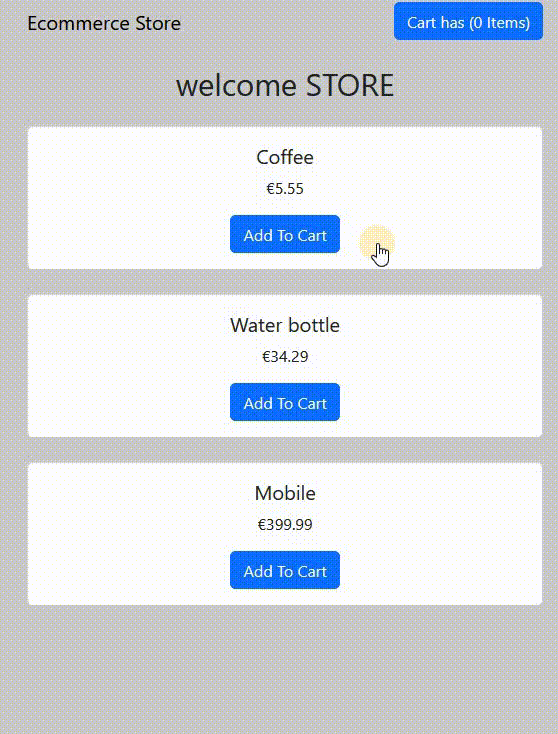

# 🛠 React - shopping cart logic

# 🔗 [Live Preview](https://serene-nougat-93e041.netlify.app/)

## Welcome! 👋

- In this project I made a shopping cart logic, that most e-commerce sites have. You can:

 ---

- Browse between 3 simulated products. Add or remove as many as you want to shopping cart

- The item info will be updated live 

- You can see in your shopping cart what items you have selected and their total cost, you can also remove them from the shopping cart too.

---

### Languages and features 👨‍💻 

- React: global/local state management, components, maps 
- Styling: Bootstrap npm package

Thanks for checking out my projects.

